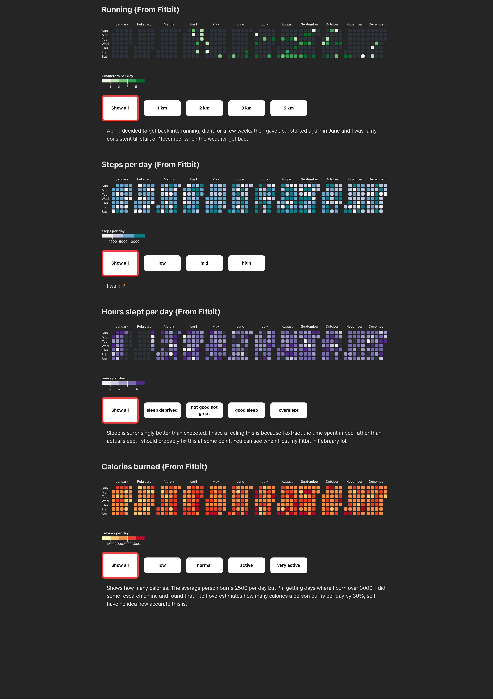

# years in data (2023, 2024, 2025)

Made this because I was too lazy to use habit tracker apps. 

Instead use data collected about me by big companies. 

https://year-in-data.vercel.app/

(old) Preview | (old) Also preview
-|-
 | 

# Info
[How I went about extracting data](docs/GatheringData.md)

## Frontend
* React Typescript
* D3.js + Tailwind + DaisyUI

## Backend
* python
* pandas + pandera
* github actions to run pipeline every month

## Todo :
- [ ] Mac os screen time
- [ ] Board game matches
- [ ] Use github pages instead of vercel
- [ ] Scrape image links into gh-pages branch (no more getting rate limited)
- [ ] Add barcharts back in for more detailed view. (maybe)